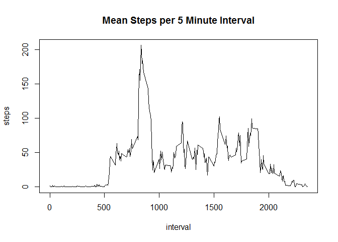
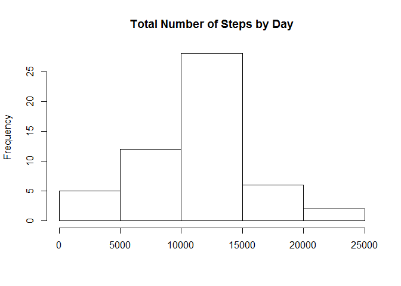
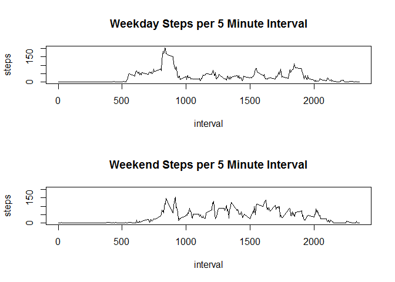

# Reproducible Research: Peer Assessment 1

Please note that the supplied template from:

https://github.com/rdpeng/RepData_PeerAssessment1/blob/master/PA1_template.Rmd

Does not perfectly match the required criteria from the assignment.

The assignment criteria is below and I have tweaked the formatting to fit the assignment.

##Review criteria 
**Repo**

1. Valid GitHub URL
2. At least one commit beyond the original fork
3. Valid SHA-1
4. SHA-1 corresponds to a specific commit

**Commit containing full submission**

1. Code for reading in the dataset and/or processing the data
2. Histogram of the total number of steps taken each day
3. Mean and median number of steps taken each day
4. Time series plot of the average number of steps taken
5. The 5-minute interval that, on average, contains the maximum number of steps
6. Code to describe and show a strategy for imputing missing data
7. Histogram of the total number of steps taken each day after missing values are imputed
8. Panel plot comparing the average number of steps taken per 5-minute interval across weekdays and weekends
9. All of the R code needed to reproduce the results (numbers, plots, etc.) in the report


**1. Code for reading in the dataset and/or processing the data**

Read in Activity Data


```r
raw_data <- read.csv(file = "activity.csv")
```

Create subset of data by Sum of Steps per Day for future use


```r
day_data <- aggregate(steps ~ date, data = raw_data, sum, na.action = na.omit)
```

**2. Histogram of the total number of steps taken each day**

Create histogram of total number of steps by day


```r
hist(day_data$steps, main = "Total Number of Steps by Day", xlab = "")
```

<!-- -->

**3. Mean and median number of steps taken each day**

Mean number of steps per day


```r
mean(day_data$steps, na.rm = TRUE)
```

```
## [1] 10766.19
```

Median number of steps per day.


```r
median(day_data$steps, na.rm = TRUE)
```

```
## [1] 10765
```

**4. Time series plot of the average number of steps taken**

Create subset of data by Mean of Steps per Interval for future use

```r
interval_data <- aggregate(steps ~ interval, data = raw_data, mean, na.action = na.omit)
```

Create Time series plot of the average number of steps taken

```r
plot(interval_data, type = "l", main = "Mean Steps per 5 Minute Interval")
```

<!-- -->

**5. The 5-minute interval that, on average, contains the maximum number of steps**

Find the 5-minute intervals that, on average, contains the maximum number of steps

```r
subset(interval_data, steps == max(interval_data$steps))$interval
```

```
## [1] 835
```

**6. Code to describe and show a strategy for imputing missing data**

Create basic strategy for imputing missing data.
Simple strategy will use Median of steps per interval to replace NA data.


```r
## Calculate median number of steps per interval
interval_data_median <- aggregate(steps ~ interval, data = raw_data, median, na.action = na.omit)

## Copy raw_data to preserve it
imputed_data <- raw_data

## Create loop to replace NA values with Median Values

for(i in 1:nrow(imputed_data)){
        if(is.na(imputed_data[i,]$steps)){
                imputed_data[i,]$steps <- 
                        interval_data_median[interval_data_median$interval == imputed_data[i,]$interval,]$steps
        }
}

summary(imputed_data)
```

```
##      steps             date          interval     
##  Min.   :  0   2012-10-01:  288   Min.   :   0.0  
##  1st Qu.:  0   2012-10-02:  288   1st Qu.: 588.8  
##  Median :  0   2012-10-03:  288   Median :1177.5  
##  Mean   : 33   2012-10-04:  288   Mean   :1177.5  
##  3rd Qu.:  8   2012-10-05:  288   3rd Qu.:1766.2  
##  Max.   :806   2012-10-06:  288   Max.   :2355.0  
##                (Other)   :15840
```

**7. Histogram of the total number of steps taken each day after missing values are imputed**

Create Histogram of the total number of steps taken each day after missing values are imputed


```r
imputed_day_data <- aggregate(steps ~ date, data = raw_data, sum, na.action = na.omit)
hist(imputed_day_data$steps, main = "Total Number of Steps by Day", xlab = "")
```

<!-- -->

**8. Panel plot comparing the average number of steps taken per 5-minute interval across weekdays and weekends**

Create panel plot comparing the average number of steps taken per 5-minute interval across weekdays and weekends (using Imputed data)


```r
## Classify each date in imputed data as weekday or weekend
for(i in 1:nrow(imputed_data)){
        if(weekdays(as.POSIXlt(imputed_data[i,]$date)) %in% c("Saturday", "Sunday")){
                imputed_data[i,"Week_Day_type"] <- "Weekend"
        }
        else {
              imputed_data[i,"Week_Day_type"] <- "Weekday"
        }
}

# Create data frames per 5 minute intervals for both Weekend and Weekday Data
weekday_interval_data <- aggregate(steps ~ interval, data = subset(imputed_data, imputed_data$Week_Day_type == "Weekday"), mean, na.action = na.omit)

weekend_interval_data <- aggregate(steps ~ interval, data = subset(imputed_data, imputed_data$Week_Day_type == "Weekend"), mean, na.action = na.omit)

#Find the maximum value that must be on the graphs, so that both y axis can be set equally
ymax <- max(weekday_interval_data$steps, weekend_interval_data$steps)

#Create panel plot of findings
par(mfrow = c(2,1))
plot(weekday_interval_data, type = "l", main = "Weekday Steps per 5 Minute Interval", ylim=c(0,ymax))
plot(weekend_interval_data, type = "l", main = "Weekend Steps per 5 Minute Interval", ylim=c(0,ymax))
```

<!-- -->


**9. All of the R code needed to reproduce the results (numbers, plots, etc.) in the report**

Code has been included in above segments.
